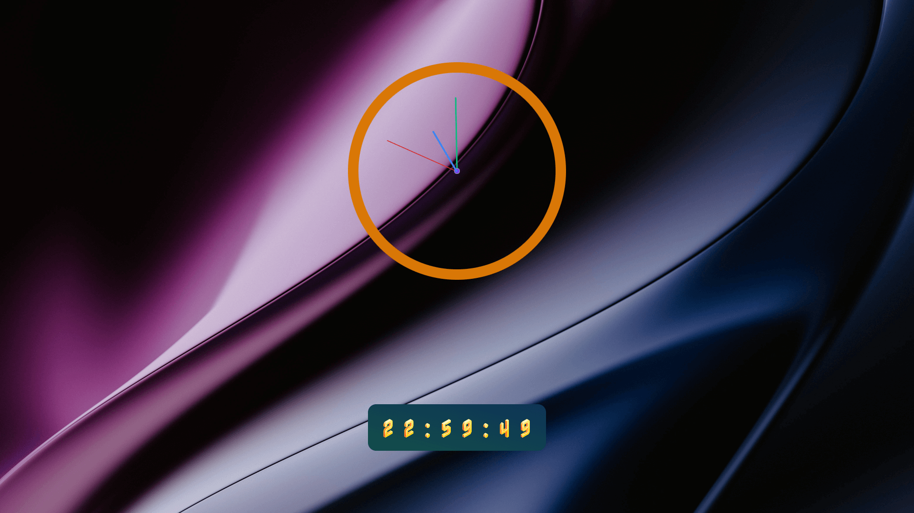

# Frontend Mentor - Fylo dark theme landing page solution

This is a solution to the [JavaScript Drum Kit](https://github.com/wesbos/JavaScript30) challenge provided by Wesbos on his JavaScript30 course.

## Table of contents

- [Overview](#overview)
  - [The challenge](#the-challenge)
  - [Screenshot](#screenshot)
  - [Links](#links)
- [My process](#my-process)
  - [Built with](#built-with)
- [Author](#author)

## Overview

### The challenge

Users should be able to:

- Create an analog clock
- Create a digital clock

### Screenshot

### Links

- Solution URL: [Solution Code](https://www.github.com/Nrupatungan/js-clock)
- Live Site URL: [Live Site](https://nrupatungan.github.io/js-clock/)

## My process

### Built with

- Semantic HTML5 markup
- CSS custom properties
- Flexbox
- Tailwind CSS
- Vanilla JS

## Author

- Frontend Mentor - [@Dinesh_Sake](https://www.frontendmentor.io/profile/Nrupatungan)
- Github - [@Dinesh_Sake](https://www.github.com/Nrupatungan)
